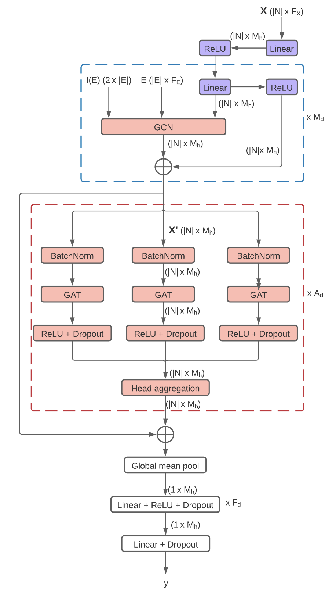

# An Attention Graph Neural Network for Stereo-active Molecules

## Introduction
<!-- Description of project -->

<!-- Project Organization
------------

    ├── LICENSE
    ├── Makefile           <- Makefile with commands like `make data` or `make train`
    ├── README.md          <- The top-level README for developers using this project.
    ├── data
    │   ├── external       <- Data from third party sources.
    │   ├── interim        <- Intermediate data that has been transformed.
    │   ├── processed      <- The final, canonical data sets for modeling.
    │   └── raw            <- The original, immutable data dump.
    │
    ├── docs               <- A default Sphinx project; see sphinx-doc.org for details
    │
    ├── models             <- Trained and serialized models, model predictions, or model summaries
    │
    ├── notebooks          <- Jupyter notebooks. Naming convention is a number (for ordering),
    │                         the creator's initials, and a short `-` delimited description, e.g.
    │                         `1.0-jqp-initial-data-exploration`.
    │
    ├── references         <- Data dictionaries, manuals, and all other explanatory materials.
    │
    ├── reports            <- Generated analysis as HTML, PDF, LaTeX, etc.
    │   └── figures        <- Generated graphics and figures to be used in reporting
    │
    ├── requirements.txt   <- The requirements file for reproducing the analysis environment, e.g.
    │                         generated with `pip freeze > requirements.txt`
    │
    ├── setup.py           <- makes project pip installable (pip install -e .) so src can be imported
    ├── src                <- Source code for use in this project.
    │   ├── __init__.py    <- Makes src a Python module
    │   │
    │   ├── data           <- Scripts to download or generate data
    │   │   └── make_dataset.py
    │   │
    │   ├── features       <- Scripts to turn raw data into features for modeling
    │   │   └── build_features.py
    │   │
    │   ├── models         <- Scripts to train models and then use trained models to make
    │   │   │                 predictions
    │   │   ├── predict_model.py
    │   │   └── train_model.py
    │   │
    │   └── visualization  <- Scripts to create exploratory and results oriented visualizations
    │       └── visualize.py
    │
    └── tox.ini            <- tox file with settings for running tox; see tox.readthedocs.io


--------

<p><small>Project based on the <a target="_blank" href="https://drivendata.github.io/cookiecutter-data-science/">cookiecutter data science project template</a> #cookiecutterdatascience</small></p> -->

## Requirement
* python >= 3.5
* torch >= 1.7
* torchvision >= 0.8
* torchaudio >= 0.7

## Usage
<!-- How to use the project - Describe briefly -->

<p align="center">

</p>

To run the optimal model, run the following command:
```{bash}
cd stereonet/run
bash optimal_exp.sh
```

To test:
```{bash}
cd stereonet/run
bash optimal_test.sh
```

To do residual analysis:
```{bash}
cd stereonet/run
bash optimal_resid_diag.sh
```

## Acknowledgement
This project was started in 12/2020 by [Sang Truong](https://sangttruong.github.io/) and [Quang Tran](https://quangntran.github.io/) under the mentorship of Professor [Brian Howard](https://github.com/bhoward). We thank 

## Citation
```
@inproceedings{
    stereonet,
    title={An Attention Graph Neural Network for Stereo-active Molecules},
    author={Sang Truong and Quang Tran},
    booktitle={CMD-IT/ACM Richard Tapia Celebration of Diversity in Computing Conference},
    year={2021}
}
```
